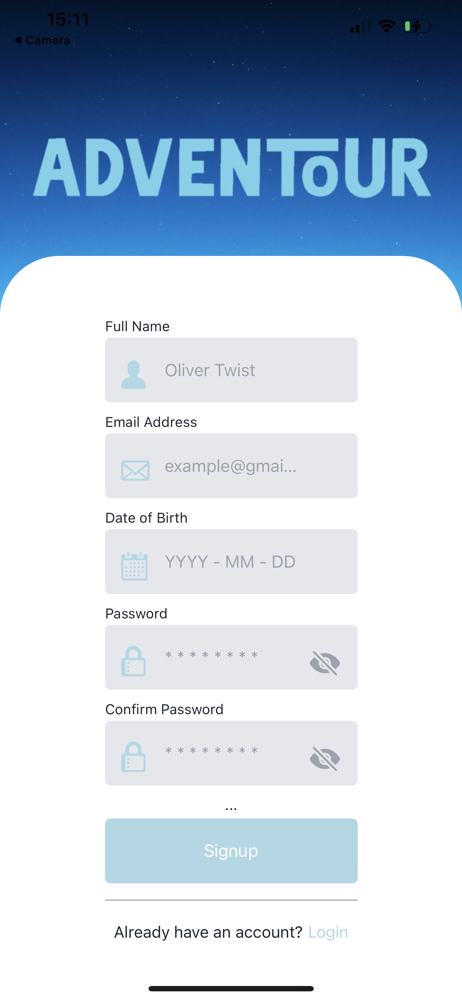
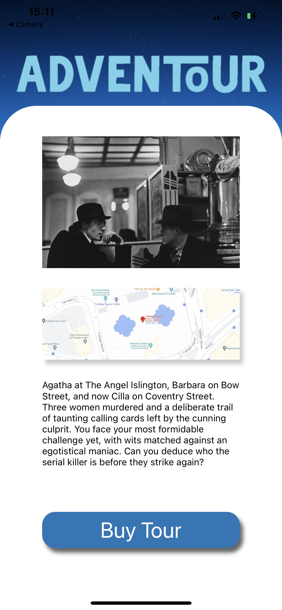

### Welcome to Adventour!

## Table of Contents

1. Introduction
2. Getting Started
3. Features
4. Future Features
5. Technologies

## Introduction

[][adventour]
[][adventour]
[][adventour]
[][adventour]

Adventour aims to reinvent the traditional way of exploring new places. The app allows you to browse tours, the results can be filtered to a genre of your interest. The tours are an interactive way to experience the history and culture of a city.

The current tour presents users with a murder mystery styled treasure hunt, with clues and directions provided to help them discover historical landmarks across London's Westend while they hunt down the ellusive 'Charing Cross Charmer'.

With an easy-to-use UI and fluid sign-up process, Adventour is a great way to get out and explore!

## Getting Started

In order to run Adventour it is necessary to install and set-up Expo. Please refer to the documentation on the Expo website for further information. This can be run on any Windows or Apple PC. Additionally, postgreSQL is required in order to run the back-end database.

1. Clone this repo & enter:

```
git clone https://github.com/jah-edw/Adventour-Frontend.git
cd client
```

2. Run `npm install` to install project dependencies into your local repo.
3. Run `npm start` to generate a QR code which can be read on your mobile (you will need to download the Expo Go mobile app)
4. Clone the backend repo:

```
git clone https://github.com/NidalEllawala/Adventour-Backend.git
```

5. Run `npm install` to install project dependencies into your local repo.
6. Create a local env. file and input local variables using the env-template file in the root of the folder as a guide.
7. Make sure PostgreSQL is running.
8. Run ` npm run dev:seed` to populate your database.
9. Run ` node index.js` or `nodemon` to start the backend.
10. Time to start exploring London!

## Features

- Login & Register
- Browse tours
- Book the tour
- Password encryption
- Take the tour

## Future Features

- More tours!
- Clues/Directions delivered by character in AR
- Sign in through Google & Facebook
- User option to create tours
- Check and leave reviews
- Implement Google API for maps

## Technologies

- TypeScript
- JavaScript
- PostgreSQL
- Sequelize
- React Native
- Redux
- Expo
- Express
- Node.js

## Collaborators

- @NidalEllawala
- @Daniel-CC-97
- @mariusobreja
- @jah-edw

[adventour]: https://github.com/jah-edw/Adventour-Frontend
